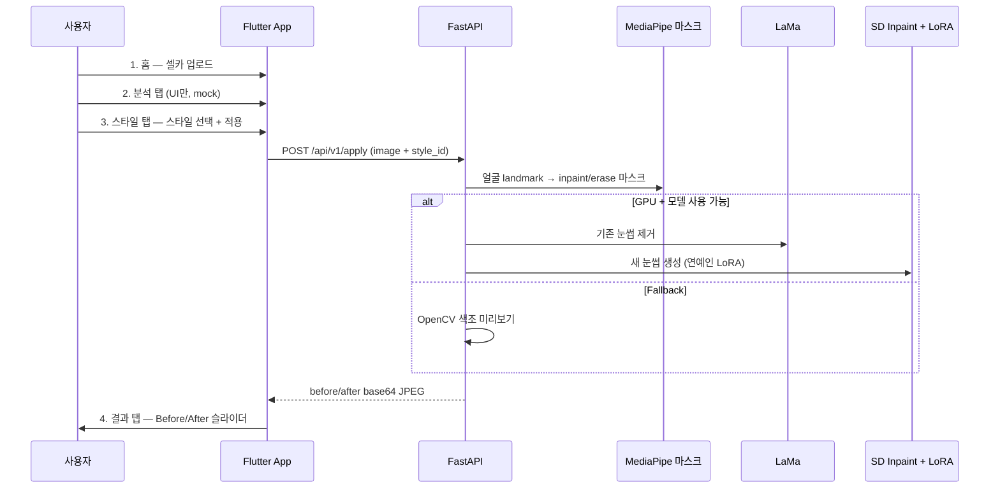

# celebfit 연동 가이드

## 전체 흐름



## 화면별 역할

| 단계 | 화면 | 동작 |
|------|------|------|
| 1 | 홈 | `image_picker`로 사진 선택 → `AppState.uploadedImageBytes` |
| 2 | 분석 | **UI만** — mock 두께/대칭/연예인 유사도 |
| 3 | 스타일 | `POST /apply` 호출 → 로딩 → 결과 탭 이동 |
| 4 | 결과 | API가 준 before/after로 슬라이더 표시 |

## 실행 순서

> iPhone 실기기 테스트: [IPHONE_SETUP.md](./IPHONE_SETUP.md) 참고

### 1) API 서버

```bash
cd celebfit
python3 -m venv .venv && source .venv/bin/activate
pip install -r api/requirements.txt
export PYTHONPATH=$PWD
python -m uvicorn api.main:app --host 0.0.0.0 --port 8000
```

확인:

```bash
curl http://127.0.0.1:8000/health
curl http://127.0.0.1:8000/api/v1/styles
```

### 2) Flutter 앱

```bash
cd celebfit_app
flutter create . --org com.celebfit --project-name celebfit_app   # 최초 1회
flutter pub get
flutter run
```

실기기에서 API 접속 시:

```bash
flutter run --dart-define=API_BASE_URL=http://<내_PC_IP>:8000
```

## AI 파이프라인 상세

```
입력 이미지
  ↓
MediaPipe Face Landmarker
  ├─ erase_mask  → LaMa 3-pass (눈썹 제거)
  └─ inpaint_mask → method2 템플릿 or landmark fallback
  ↓
Stable Diffusion Inpaint (epiCRealism + LoRA)
  prompt: "{연예인} style eyebrows ..."
  ↓
Gaussian blend → 원본 해상도 JPEG
  ↓
API 응답 (before + after base64)
```

## style_id 매핑

| App style_id | LoRA 프롬프트 |
|--------------|---------------|
| go_yoonjung | 고윤정 style eyebrows |
| shin_sekyung | 신세경 style eyebrows |
| hong_sooju | 홍수주 style eyebrows |
| natural / soft_arch / straight | generic prompt (LoRA scale 낮춤) |

## 파일 위치

```
celebfit/
├── api/                          # FastAPI 백엔드
│   ├── main.py
│   ├── routes/apply.py
│   └── services/pipeline.py      # AI 파이프라인
├── celebfit_app/                 # Flutter 앱
│   └── lib/services/api_service.dart
└── weights/                      # 자동 다운로드 모델
```

## 문제 해결

| 증상 | 해결 |
|------|------|
| "서버 연결 실패" | API 실행 여부, 방화벽, Base URL 확인 |
| "얼굴을 찾지 못했습니다" | 정면 셀카, 밝은 조명 |
| 결과가 원본과 비슷 | fallback 모드 — GPU/SD 모델 확인 |
| Android 에뮬레이터 연결 안 됨 | `10.0.2.2:8000` 사용 |
