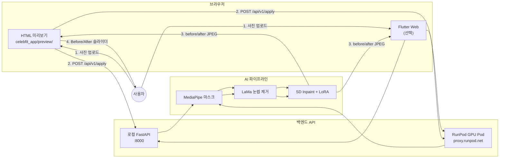

# Conditional Eyebrow Image Generation (SD Inpaint + Celeb LoRA)

이 프로젝트는 **BiSeNet(Face Parsing)** 기반의 정교한 눈썹 마스킹 기술과 **Stable Diffusion Inpainting + LoRA** 파이프라인을 결합하여, 이미지 내의 눈썹을 특정 배우 스타일(고윤정, 신세경, 홍수주)로 자연스럽고 사실적으로 변형 및 생성하는 프로젝트입니다.

> [!IMPORTANT]
> **BrushNet 관련 변경 안내:**
> 기존의 BrushNet 의존성이 완전히 제거되었습니다. **이제 BrushNet의 대용량 체크포인트(brushnetx)를 별도로 다운로드할 필요가 없습니다.**

---

## 브랜치 & 문서 안내

| 브랜치 | 역할 | 주요 경로 |
|--------|------|-----------|
| **main** | ML / 눈썹 변환 파이프라인 | `pipeline/`, `masking_bisenet/`, `lora_checkpoint/` |
| **app** | main + Flutter 앱 + FastAPI + RunPod 배포 | `celebfit_app/`, `api/`, `deploy/`, `scripts/` |

| 목적 | 문서 |
|------|------|
| **앱을 브라우저에서 실행** | 아래 [앱 브라우저 실행](#-앱-브라우저-실행-app-브랜치) |
| API ↔ Flutter 연동 | [INTEGRATION.md](./INTEGRATION.md) |
| RunPod GPU 배포 | [RUNPOD.md](./RUNPOD.md) |
| main → app 자동 동기화 | [SYNC_BRANCHES.md](./SYNC_BRANCHES.md) |

---

## 📦 의존성 패키지 (Dependencies)

### 핵심 의존성

| 패키지 | 버전 | 용도 |
|---|---|---|
| `torch` | ≥ 2.0 | PyTorch 딥러닝 프레임워크 (MPS/CUDA 가속) |
| `torchvision` | - | 이미지 전처리 유틸리티 |
| `diffusers` | ≥ 0.25 | Stable Diffusion Inpainting 파이프라인 |
| `transformers` | ≥ 4.30 | CLIP Text Encoder 로딩 |
| `peft` | ≥ 0.6 | LoRA 어댑터 로딩 (`PeftModel`) |
| `accelerate` | - | 모델 CPU/GPU offload 지원 |
| `safetensors` | - | 가중치 저장/로딩 포맷 |

### 이미지 처리

| 패키지 | 용도 |
|---|---|
| `opencv-python` | 마스크 생성, 색상 보정, Canny Edge, 블렌딩 |
| `Pillow` | PIL ↔ NumPy 이미지 변환 |
| `numpy` | 배열 연산 및 마스크 처리 |

### 얼굴 분석

| 패키지 | 용도 |
|---|---|
| `onnxruntime` | BiSeNet 얼굴 분할 모델 추론 (ONNX) |
| `mediapipe` ≥ 0.10 | Face Landmark 기반 적응형 눈썹 마스크 생성 |

### 인페인팅

| 패키지 | 용도 |
|---|---|
| `simple-lama-inpainting` | LaMa 기반 눈썹 지우기 (3-pass 재귀 인페인팅) |
| `huggingface_hub` | HuggingFace 모델 자동 다운로드 |

### 설치 방법

```bash
python -m venv .venv
source .venv/bin/activate
pip install -r requirements.txt
```

---

## 📁 프로젝트 구조 & 주요 모듈 (Main Modules)

```
ConditionalImageGeneration/
├── pipeline/
│   ├── main.py              # 🔥 핵심 추론 파이프라인 (단일 엔트리포인트)
│   ├── train_lora.py         # LoRA 학습 스크립트
│   └── run_multiple.py       # 배치 실행 스크립트
├── masking_bisenet/
│   ├── generate_mask_bisenet.py  # BiSeNet 얼굴 파싱 → 눈썹 마스크 추출
│   └── face-parsing/weights/    # ONNX 가중치 (resnet18/34)
├── util/
│   ├── crop_face.py          # 얼굴 영역 자동 Zoom Crop & Restore
│   ├── dilate_mask.py        # 마스크 팽창
│   ├── smooth_mask.py        # 마스크 경계 평활화
│   ├── color_transfer.py     # LAB 색공간 색상 보정
│   ├── erode_mask.py         # 마스크 침식
│   └── augment.py            # 데이터 증강
├── data/
│   ├── face_landmarker.task  # MediaPipe 랜드마크 모델 (자동 다운로드)
│   ├── actor.jpeg            # 테스트 이미지
│   └── raw_face_data/        # AI 생성 얼굴 이미지 데이터셋
├── lora_checkpoint/
│   └── celeb_eyebrows_all_pro_v4/  # 학습된 LoRA 가중치
│       ├── unet/
│       └── text_encoder/
├── tests/
│   ├── test_raw_generation_experiment.py  # 파이프라인 실험 스크립트
│   ├── test_pipeline_stages.py            # 5단계 시각화 스크립트
│   └── test_mediapipe_mask.py             # MediaPipe 마스크 테스트
└── requirements.txt
```

---

## 🔥 핵심 파이프라인: `pipeline/main.py`

### 파이프라인 처리 흐름

```
입력 이미지 (원본 해상도)
    │
    ▼
┌──────────────────────────────────┐
│ 1. BiSeNet 눈썹 마스크 생성       │   generate_bisenet_face_parts_mask()
│    → dilate(15px) → smooth       │   dilate_mask() → smooth_mask()
└──────────┬───────────────────────┘
           ▼
┌──────────────────────────────────┐
│ 2. Zoom Crop → 512×512           │   get_zoom_crop_info(padding=1.3)
│    (눈썹 영역에 밀착 확대)         │   apply_crop(target_size=512)
└──────────┬───────────────────────┘
           ▼
┌──────────────────────────────────┐
│ 3. MediaPipe 적응형 마스크 생성    │   make_brow_mask_from_landmarks()
│    → LaMa 3-pass 눈썹 지우기      │   SimpleLama() × 3회
└──────────┬───────────────────────┘
           ▼
┌──────────────────────────────────┐
│ 4. SD Inpaint + LoRA 생성         │   StableDiffusionInpaintPipeline
│    prompt: "{celeb} style"        │   + PeftModel (LoRA V4)
│    strength=0.60, steps=40        │   guidance=6.0, seed=42
└──────────┬───────────────────────┘
           ▼
┌──────────────────────────────────┐
│ 5. 후처리 & 블렌딩                 │
│    a) LAB 색상 보정               │   color_transfer()
│    b) BiSeNet 새 눈썹 마스크 검출  │   generate_bisenet_face_parts_mask()
│    c) 원본 해상도 복원             │   restore_crop()
│    d) Soft Alpha 블렌딩           │   GaussianBlur + mask blending
└──────────┬───────────────────────┘
           ▼
      최종 결과 이미지 (원본 해상도)
```

### Core I/O (입출력 사양)

#### 입력 (Input)

| 항목 | 설명 |
|---|---|
| **입력 이미지** | 임의 해상도의 RGB 얼굴 이미지 (JPG/PNG) |
| **타겟 스타일** | 셀럽 이름 문자열 (`"고윤정"`, `"신세경"`, `"홍수주"`) |
| **LoRA 가중치** | `lora_checkpoint/celeb_eyebrows_all_pro_v4/` |
| **BiSeNet 가중치** | `masking_bisenet/face-parsing/weights/resnet34.onnx` |
| **MediaPipe 모델** | `data/face_landmarker.task` (첫 실행 시 자동 다운로드) |

#### 출력 (Output)

| 항목 | 설명 |
|---|---|
| **최종 결과** | 원본 해상도의 눈썹 변형 이미지 (PNG) |
| **저장 경로** | `pipeline/outputs/result_{이미지명}_{셀럽명}_{타임스탬프}.png` |

#### 실행 방법

```bash
# 기본 실행 (actor.jpeg + raw_face 7장 × 3 셀럽)
python pipeline/main.py
```

### 하이퍼파라미터

| 파라미터 | 값 | 설명 |
|---|---|---|
| `lora_scale` | 1.15 | LoRA 어댑터 가중치 스케일 |
| `strength` | 0.60 | SD Inpaint 변형 강도 (0~1) |
| `num_inference_steps` | 40 | 디노이징 스텝 수 |
| `guidance_scale` | 6.0 | CFG (Classifier-Free Guidance) 스케일 |
| `seed` | 42 | 재현성을 위한 고정 시드 |
| `controlnet_conditioning_scale` | 0 | ControlNet 비활성 (순수 LoRA 생성) |
| `LaMa passes` | 3 | 눈썹 지우기 반복 횟수 |
| `padding_ratio` | 1.3 | Zoom Crop 영역 여백 비율 |

---

## 📥 모델 가중치 및 데이터 설정 (Weights & Data Setup)

### 1. BiSeNet 가중치 (얼굴 분할용)
```bash
cd masking_bisenet/face-parsing
chmod +x download.sh
./download.sh
cd ../..
```
* **결과 확인:** `masking_bisenet/face-parsing/weights/` 폴더 내에 `resnet18.onnx`와 `resnet34.onnx`가 준비되어야 합니다.

### 2. Base Model (기반 확산 모델)
* 기본적으로 초고화질 실사 체크포인트인 **`emilianJR/epiCRealism`**을 사용합니다.
* 코드를 실행할 때 Hugging Face Diffusers를 통해 캐시 디렉토리로 자동 다운로드되므로 수동 다운로드가 필요하지 않습니다.

### 3. LoRA 가중치
* 훈련된 LoRA 가중치: `lora_checkpoint/celeb_eyebrows_all_pro_v4/`
  - `unet/`: UNet LoRA 어댑터
  - `text_encoder/`: Text Encoder LoRA 어댑터

### 4. 학습 및 테스트 데이터 구조
* **배우 원본 이미지**: `data/actor_raw_data/{배우이름}/001.jpg` ...
* **학습용 눈썹 마스크 및 누끼**: `data/수정본/{배우이름}_mask/`
  - `extracted/`: 흰색 배경의 눈썹 이미지 (`_tight_white_bg.png`)
  - `tight/`: 타이트한 흑백 마스크 이미지 (`_tight_mask.png`)
  - `padded_2px/`: 2px 팽창된 마스크 이미지 (피부 경계면 자연스러운 블렌딩 학습용)

---

## 🚀 전체 개발 & 검증 워크플로우 (Workflow)

### Step 1. LoRA 학습
```bash
python pipeline/train_lora.py
```

### Step 2. 단일/배치 인퍼런스 실행
```bash
python pipeline/main.py
```
* **결과 저장**: `pipeline/outputs/` 에 저장됩니다.

### Step 3. 파이프라인 단계 시각화
각 처리 단계 (원본 → 지우기 → Crop → SD 생성 → 최종 블렌딩) 의 중간 결과물을 한 눈에 확인:
```bash
python tests/test_pipeline_stages.py
```

### Step 4. 실험 그리드 비교 (MediaPipe Mask Overlay 스타일)
3가지 셀럽 스타일을 한 줄로 비교하되, 마스크를 반투명 오버레이로 시각화:
```bash
python tests/test_raw_generation_experiment.py
```

---

## 🌐 웹 서비스 전환 시 고려사항 (Web Service Deployment Notes)

`pipeline/main.py`를 웹 서비스로 전환할 때 다음 사항들을 고려해야 합니다:

### 1. 모델 초기화 분리 (`load_models` 재활용)

> [!IMPORTANT]
> 현재 `load_models()` 함수가 모델을 한 번만 로딩하고 `(pipe, lama, device)` 튜플을 반환하는 구조로 되어 있습니다.
> 웹 서버에서는 **서버 시작 시 1회만 호출**하고, 요청마다 `run_pipeline()` 만 호출하면 됩니다.

```python
# FastAPI 예시
app = FastAPI()
pipe, lama, device = None, None, None

@app.on_event("startup")
async def startup():
    global pipe, lama, device
    pipe, lama, device = load_models()  # 서버 시작 시 1회만 로딩

@app.post("/generate")
async def generate(image: UploadFile, celeb: str):
    run_pipeline(image_path, celeb, pipe, lama, device)
```

### 2. GPU 메모리 관리

> [!WARNING]
> SD 1.5 + LoRA 모델은 **약 4~6GB VRAM**을 사용합니다. 동시 요청이 많으면 OOM이 발생할 수 있습니다.

| 전략 | 설명 |
|---|---|
| **요청 큐** | 동시 생성을 1건으로 제한 (`asyncio.Semaphore`) |
| **CPU Offload** | `pipe.enable_model_cpu_offload()` 유지 |
| **Batch 제한** | 한 요청당 셀럽 1명만 생성 |

### 3. I/O 인터페이스 변환

현재 `run_pipeline()`은 **파일 경로를 입력으로 받고 파일을 디스크에 저장**합니다. 웹 서비스에서는:

```python
# 현재 (파일 기반)
def run_pipeline(image_path: str, celeb: str, pipe, lama, device)

# 웹 서비스 (바이트 스트림 기반)
def run_pipeline(image_bytes: bytes, celeb: str, pipe, lama, device) -> bytes
```

주요 변경점:
- `cv2.imread(path)` → `cv2.imdecode(np.frombuffer(image_bytes), cv2.IMREAD_COLOR)`
- `cv2.imwrite(path, result)` → `_, buffer = cv2.imencode('.png', result); return buffer.tobytes()`

### 4. MediaPipe 모델 경로

> [!CAUTION]
> `face_landmarker.task` 파일의 경로가 **상대 경로 기반** (`data/face_landmarker.task`)으로 되어 있습니다.
> Docker 컨테이너 또는 서버 배포 시 **절대 경로 또는 환경 변수**로 변경해야 합니다.

### 5. 응답 시간 예상

| 장비 | 1건 생성 시간 |
|---|---|
| Apple M-series (MPS) | ~25초 |
| NVIDIA RTX 3090 (CUDA) | ~8초 |
| CPU Only | ~120초 이상 |

> [!TIP]
> 실시간 응답이 필요한 서비스라면 **비동기 작업 큐 (Celery / Redis)** 도입을 권장합니다.
> 프론트엔드에서 요청 → 백엔드에서 큐에 넣기 → 완료 시 WebSocket으로 알림 → 결과 이미지 전송.

### 6. 추천 웹 프레임워크

| 프레임워크 | 장점 |
|---|---|
| **FastAPI** | 비동기 지원, 자동 Swagger 문서, 가장 적합 |
| **Gradio** | 빠른 프로토타입, UI 자동 생성 (데모용) |
| **Streamlit** | 간단한 인터랙티브 대시보드 (내부 테스트용) |

---

## 📱 앱 브라우저 실행 (app 브랜치)

`app` 브랜치에서 celebfit UI를 브라우저로 실행하는 방법입니다.  
Flutter 설치 없이 **HTML 미리보기**로 바로 확인하는 것을 권장합니다.

### 전체 흐름



**사용자 시나리오 (4단계)**

1. **홈** — 셀카 업로드
2. **분석** — UI만 (mock 데이터, API 미연동)
3. **스타일** — 고윤정 / 신세경 / 홍수주 선택 → **적용하기** → API 호출
4. **결과** — Before/After 슬라이더로 변환 결과 확인

---

### 방법 1: HTML 미리보기 (권장 · Flutter 불필요)

저장소 루트에서 한 줄로 실행합니다.

```bash
git checkout app
./scripts/open_app_preview.sh
```

브라우저가 `http://127.0.0.1:8765/preview/index.html` 을 엽니다.

| 단계 | 동작 |
|------|------|
| 1 | 상단 배너에서 API **연결됨** / **미연결** 확인 |
| 2 | **홈** → 사진 업로드 |
| 3 | **스타일** → 연예인 스타일 선택 → **적용하기** |
| 4 | **결과** → Before/After 슬라이더 |

**RunPod GPU API 연동** (실제 AI 변환):

```bash
./scripts/open_app_preview.sh https://YOUR_POD_ID-8000.proxy.runpod.net
```

또는 미리보기 **MY 탭**에서 RunPod URL을 저장하면 `localStorage`에 유지됩니다.

**로컬 API만 쓸 때** (Mac에서 GPU/MPS 테스트):

```bash
# 터미널 1 — API
python3 -m venv .venv && source .venv/bin/activate
pip install -r api/requirements.txt
export PYTHONPATH=$PWD
python -m uvicorn api.main:app --host 0.0.0.0 --port 8000

# 터미널 2 — 브라우저 미리보기
./scripts/open_app_preview.sh
```

API 상태 확인:

```bash
curl http://127.0.0.1:8000/health
```

> API 미연결 시에도 UI는 **데모 모드**로 동작합니다. 실제 AI 변환은 RunPod 또는 로컬 API 연결이 필요합니다.

---

### 방법 2: Flutter Web (Chrome)

네이티브 앱과 동일한 Flutter UI를 Chrome에서 실행합니다. Flutter SDK가 필요합니다.

```bash
cd celebfit_app
flutter pub get
flutter create . --org com.celebfit --project-name celebfit_app --platforms=web   # 최초 1회
flutter run -d chrome
```

API Base URL 지정:

```bash
flutter run -d chrome --dart-define=API_BASE_URL=http://127.0.0.1:8000
# RunPod:
flutter run -d chrome --dart-define=API_BASE_URL=https://YOUR_POD_ID-8000.proxy.runpod.net
```

| 플랫폼 | 기본 API URL |
|--------|----------------|
| Chrome / iOS / macOS | `http://127.0.0.1:8000` |
| Android 에뮬레이터 | `http://10.0.2.2:8000` |

---

### 방법 3: RunPod만 사용 (로컬 API 없음)

1. [RUNPOD.md](./RUNPOD.md)대로 Pod 배포 (`app` 브랜치)
2. `./scripts/verify_runpod_api.sh https://YOUR_POD_ID-8000.proxy.runpod.net` 로 health 확인
3. `./scripts/open_app_preview.sh https://YOUR_POD_ID-8000.proxy.runpod.net`

---

### app 브랜치 파일 점검 (불필요·중복 정리)

| 항목 | 조치 | 이유 |
|------|------|------|
| `celebfit_app/preview/mock/` | **삭제 · gitignore** | `preview/index.html`과 100% 동일한 임시 복사본 |
| `celebfit_app/preview/.serve/` | **삭제 · gitignore** | 로컬 서버 실행 시 생기는 런타임 복사본 |
| `celebfit_app/preview/assets/celebs/` | **삭제** | `celebfit_app/assets/celebs/`와 동일 이미지 중복 (~380KB×3) |
| `brushnet/` (430+ 파일) | **유지** (main merge) | main에서 자동 sync되며, 현재 API 런타임에서는 **미사용** |
| `pipeline/outputs/`, `weights/` | **gitignore** | 실행 시 생성되는 런타임 산출물 |

**유지해야 하는 app 전용 경로**

```
celebfit_app/          # Flutter 앱 + HTML 미리보기
├── preview/index.html # 브라우저 UI (Flutter 없이 실행)
├── assets/celebs/     # 스타일 썸네일 (Flutter·미리보기 공용)
api/                   # FastAPI 백엔드
deploy/                # RunPod/Docker 배포
scripts/open_app_preview.sh
```

main 팀원이 `main`에 push하면 [SYNC_BRANCHES.md](./SYNC_BRANCHES.md)의 GitHub Action이 **app에 자동 merge**합니다. main 브랜치는 수정하지 않습니다.
